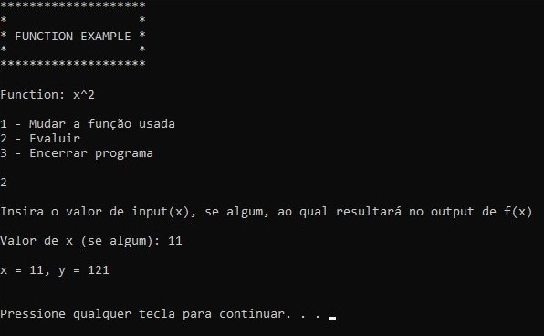
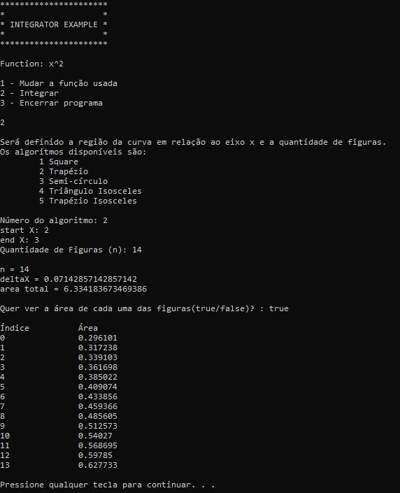

# LibFunction

LibFunction é uma biblioteca em C++ para cálculos de funções e de integrais. 

**Foi elaborada durante a disciplina de Modelagem Computacional na graduação em Ciência da Computação e não foi planejada para ser usada em produção**.

Visit [LibFunction Documentation](https://manvin1.github.io/LibFunction/)

## Features

- Uma interface simples para definição e manipulação de funções e cálculo de integrais;

- Suporte aos seguintes operadores e/ou expressões:

  - literais numéricos ou com exatamente um caractere alfabético;

  - expressões parentrizadas;

  - operadores unários (+, -);

  - operadores binários (+, -, *, /, ^, SQRT);

  A gramática pode ser verificada em /LibFunction/Grammar/Algebric.g4.

- Integração por cinco métodos diferentes:

  - Quadrado;

  - Trapézio;

  - Semi-círculo (d = deltaX);

  - Triângulo Isosceles (na extremidade);

  - Trapézio Isosceles (na extremidade);

## Limitations/TODO

- Expressões inválidas podem falhar silenciosamente, sendo evaluadas da melhor maneira possível, ignorando caracteres inválidos, etc.

## Dependencies

- [antl4](https://www.antlr.org/). 

  LibFunction usa antl4 para a tokenization e parsing das expressões, que necessita tanto auto-generated code quanto de um runtime (*.dll or *.lib). antlr4 pode ser usado sob a BSD-3, que é permissiva.

- c++20 std library.
  
## How Build 

A solução foi feita usando o Visual Studio 2022 e o projeto 'Example' está previamente configurado.

1. Build as dependências de LibFunction como Static Libraries e as insira corretamente em /Dependencies/* em um diretório com o mesmo nome (crie estes diretórios).

    LibFunction foi configurada para usar static linking, caso não queria basta ignorar esta parte.

    1. Crie dois diretórios lib e src.
    2. Em lib, após buildar as dependências, insira os diretórios Debug Static e o Release Static gerados, com o *.lib.
    3. Em src, crie outro diretório com o nome da biblioteca e insira os *.h e *.cpp.
    
    Note que a [antlr4 library](https://www.antlr.org/) chama a sua implementação de "C++ runtime" e que caso seja usado uma static library, necessita da diretiva ANTLR4CPP_STATIC em todos os projetos que a usam.

2. Build LibFunction *.lib ou *.dll

    A solução foi preparada esperando static libraries e já foi inserido as diretivas como "ANTLR4CPP_STATIC", mas isso pode ser mudado facilmente.
  
3. Use a LibFunction como uma dependência de um projeto.

## Samples

No diretório "Samples" tem-se amostras em *.cpp que demonstram o uso das classes Function e Integrator. O projeto 'Example' está configurado, possibilitando um *quick test*.

- Function Example

  

  Demonstra o uso da class Function, que possibilita resolver funções.

- Integrator Example

  

  Demonstra o uso da class Integrator, que possibilita integrar uma função especifica.

## License

LibFunction is available under dual licensing and can be used under or BSD-3 license or CC0 license. 

## Acknowledgment 

A implementação se inspirou na implementação apresentada em "Programming - Principles and Practice Using C++", 2014, de Bjarne Stroustrup, e no apresentado nos manuais de <https://tomasseti.me> como <<https://tomassetti.me/guide-parsing-algorithms-terminology/>>, <<https://tomassetti.me/getting-started-antlr-cpp/>> e <<https://tomassetti.me/antlr-mega-tutorial/>> (Acesso em 2023), aos quais foram de bastante ajuda.

## Disclaimer

This software library is not affiliated with or endorsed by the authors of the third-party libraries, other resources or by sources used as inspiration that were used in its implementation.
